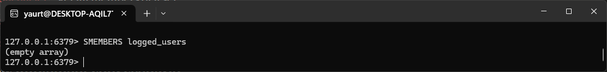
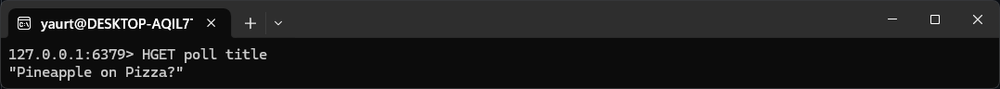

**This is the report for the construction of Assignment 5**

**Step 0**
1. I started by looking over the guide for Redis for installing it on Linux, using the WSL I installed in the first assignment.
2. After installing the required daemons, I tested the server and it worked.

**Use Case 1**
1. After reading the documentation of Redis Set datatype, I started by using the methods presented in the documentation and creating a Set based on the criteria presented for this Use Case.

**Use Case 2**
1. For this I had some issues figuring out how to build the database the same as the JSON one presented in the assignment. I searched for some examples on Google and Youtube, where I found some tips that helped. However, the first attempt was wrong, since everything was nested to the poll, even the votes caption and count, which should be nested to the voteOptions. After some trial and errors, I managed to get the data the same as required.

**Step 3**
1. I added the dependency for the Redis in the gradle builder and configured it.
2. I made a new test class where I could implement the datatypes presented in the Use Cases. For some inspiration, I read some examples presented in the Baeldung website.
3. After implemented everything, I run the test, but it appear it failed, since I closed the WSL in the meanwhile. After, starting it again, the test worked.

**Step 4**
1. I had some struggles about how to solve this step, I looked again at the Baeldung website for some help.
2. I configured a small Redis config for the cache
3. After, I created a service for getting all the Poll data from the Redis database, invalidate the cache and afterward to increment the vote count.
4. I was getting some errors because of the imports that I had, and I didn't have the required dependency to work wit h the Redis data, so I had to fix this in order to continue.
5. The last step was to use the same structure from previous step and implement the cache methods for testing. After calling them and getting the data, I could see that the caching was way faster.

