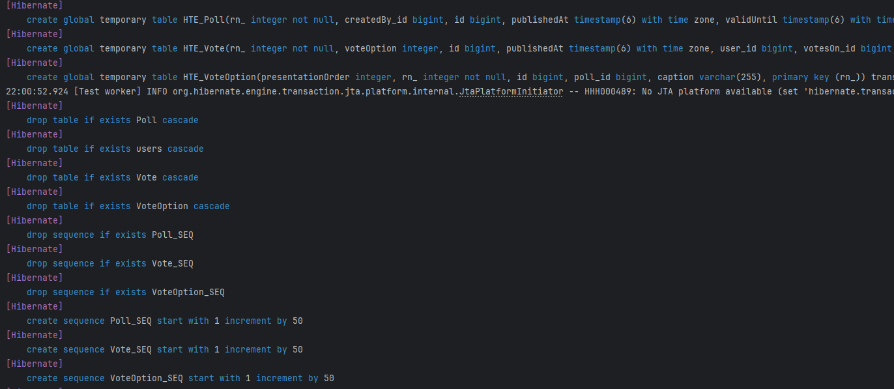
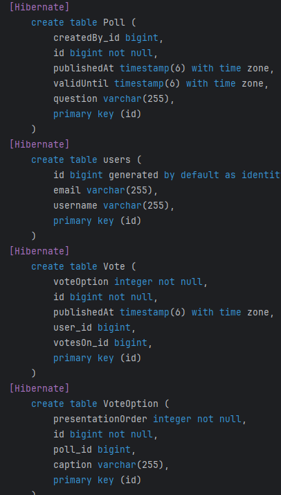
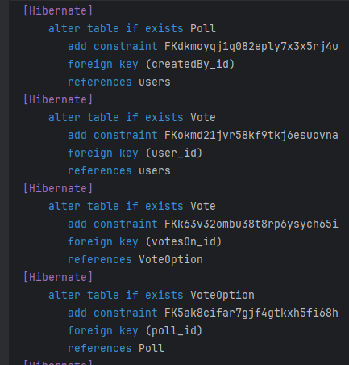
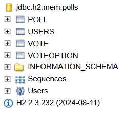
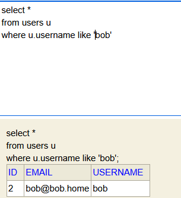

**This is the report for the construction of Assignment 4**

**Step 0**
1. This is related to Assignment 3, I managed to fix the static files from the Angular build to work here on Spring Boot with the same port, and calling the endpoints as well.

**Step 1**
1. I installed the new dependencies presented in the Assignment description.

**Step 2**
1. I created the new PollsTest in the test folder, and made sure that all the imports were correct.
2. Afterward, I started to work on the User class and fill the methods that was supposed to be implemented.
3. I was confused about _**this.created**_ since it didn't specify that it will be for the polls, but I made just a simple Set for it.
4. I had some struggles when implementing the **_voteFor_** method since I had to do some modifications in the **Vote** and **VoteOption** entity classes, in order to have the proper logic.
5. I had some struggles as well when implementing the **_addVoteOption_** method in the **Poll** class, since I needed to follow the description of the method, having the correct **presentationOrder**.

**Step 3**
1. After fixing the methods and getting no more compile errors for the tests, I started the tests.
2. The first tests failed since the connection to the database wasn't implemented yet.
3. I started by adding the correct annotations for the entities and making an ID for each.
4. After that, when I tested again, I got the error that I couldn't insert into **User** table in the database. Here I sat a good time trying to figure out what can be wrong with my annotations, and after going back and forth to the documentation and the short-guide presented in the assignment, I figured out that I needed to specify the exact name of the table, which I deducted from the query from the tests.
5. After that, I made sure that the relationship between the entities were as expected to be, after analyzing the queries in which the tests are written. Needed to make sure that the name also for the variables are appropriate.

**Step 4**
1. After running the tests again, I needed to debug to see if the methods that I wrote earlier had the proper logic, since I was getting errors of null and multiple empty array. This indicated that the methods were not properly implemented as they should be.
2. Fixing the methods with the proper logic resulted in the tests going green.

**_Model Entity_**

**Explanation for the tests**
1. Before running each test in particular, the database will be created locally, since we are using H2 Database Engine in order to test the ORM. For this, I made a local server where we can connect to the GUI of the database, in order to inspect the state in which the database is.
2. So from the first picture, we can see that the database is just created, but not populated yet. In order to check when the database is populated, I added the sql statements property in the **_setup_** method to check what's send.

3. The next three pictures shows the SQL queries which are used everytime for each test, since we have the property of drop and create in the **_setup_**. This means they are recreated for each test individually.

4. For the last picture, this is how the database looks like after the running of all the required SQL queries. In this GUI we can also try and mimic the queries from the test in order to see if the information we are receiving is correct.

**_Test Result_**

